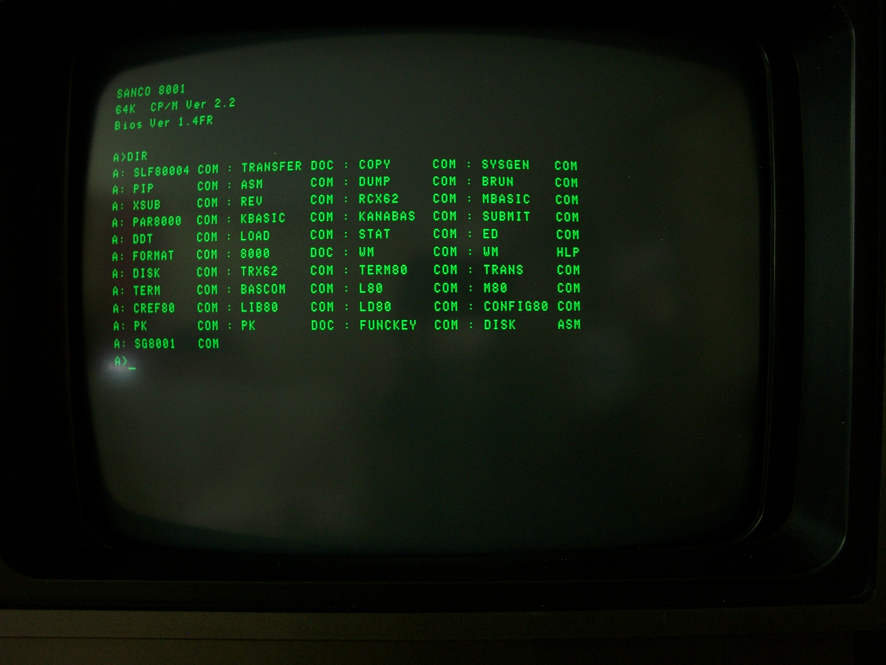

# CPM-Emulator

[![License][license-image]][license-url] [](https://github.com/Marcussacapuces91/CPM-Emulator/actions/workflows/build.yml)

> Yet another Z80 Computer with CP/M capabilities (no BIOS, emulated BDOS, executed CP/M)

<!--
[![NPM Version][npm-image]][npm-url]
[![Build Status][travis-image]][travis-url]
[![Downloads Stats][npm-downloads]][npm-url]
-->

A C++ CP/M machine emulator with embedded [Z80 by Sainz de Baranda y Goñi, Manuel <manuel@zxe.io>](https://github.com/redcode/Z80). BDOS functions are C++ coded. BIOS functions are not provided (until now).

Tested with ZEXDOC from http://mdfs.net/Software/Z80/Exerciser/

<figure>
  
  <figcaption>Par <a href="//commons.wikimedia.org/wiki/User:Mspecht" title="User:Mspecht">Mspecht</a> — <span class="int-own-work" lang="fr">Travail personnel</span>, <a href="https://creativecommons.org/licenses/by-sa/3.0" title="Creative Commons Attribution-Share Alike 3.0">CC BY-SA 3.0</a>, <a href="https://commons.wikimedia.org/w/index.php?curid=16374288">Lien</a></figcaption>
</figure>
  
## Installation

<!--
OS X & Linux:

```sh
npm install my-crazy-module --save
```

Windows:

```sh
edit autoexec.bat
```
-->

## Usage example

A few motivating and useful examples of how your product can be used. Spice this up with code blocks and potentially more screenshots.

_For more examples and usage, please refer to the [Wiki][wiki]._

## Development setup

* Installer le code disponible dans ce repository. 
* Ajouter le code de https://github.com/redcode/Z80 ([licence GNU Public Licence v3](http://www.gnu.org/copyleft/gpl.html)) :

  Copier les fichiers suivant dans le répertoire /source :
    * [Z80.h](https://github.com/redcode/Z80/blob/master/API/emulation/CPU/Z80.h) et 
    * [Z80.c](https://github.com/redcode/Z80/blob/master/sources/Z80.c).


* Ajouter aussi le code, sur la base du commentaire (https://github.com/redcode/Z/issues/3#issuecomment-520175069) pour remplacer la [lib Z](https://github.com/redcode/Z) qui ne compile pas sous GCC :
    * [Z80-support.h](https://github.com/simonowen/tilemap/blob/master/Z80-support.h)

<!--
```sh
make install
npm test
```
-->

## Release History

* 0.2
    * CHANGE: Remplacement par le moteur https://github.com/redcode/Z80 ;
    * CHANGE: Reprise de l'affichage des mnemonics ;
    * Passe les tests ZEXDOC (presque).
* 0.1
    * Premières fonctions BDOS et moteur Z80 perso.
    * Echec des tests ZEXDOC.

## Meta

Marc SIBERT – [@LabAllen91](https://twitter.com/LabAllen91) – contact@dispositifs.fr

Distributed under the Apache 2.0 license. See [``LICENSE``](https://github.com/Marcussacapuces91/CPM-Emulator/blob/main/LICENSE) for more information.

[https://github.com/Marcussacapuces91/CPM-Emulator](https://github.com/Marcussacapuces91/CPM-Emulator)

## Contributing

1. Fork it (<https://github.com/Marcussacapuces91/CPM-Emulator/fork>)
2. Create your feature branch (`git checkout -b feature/fooBar`)
3. Commit your changes (`git commit -am 'Add some fooBar'`)
4. Push to the branch (`git push origin feature/fooBar`)
5. Create a new Pull Request

## References

* https://github.com/joelang/z80-sbc: Source code of [cpm22.lst](https://raw.githubusercontent.com/joelang/z80-sbc/master/cpm22.lst)
* BDOS functions & explanations: http://seasip.info/Cpm/bdos.html
* CP/M FCB: http://seasip.info/Cpm/fcb.html
* Z80 Instruction Exerciser: http://mdfs.net/Software/Z80/Exerciser/
* Z80 Flags Affection: http://www.z80.info/z80sflag.htm
* Z80 instruction set: https://clrhome.org/table/
* 


<!-- Markdown link & img dfn's -->
[npm-image]: https://img.shields.io/npm/v/datadog-metrics.svg?style=flat-square
[npm-url]: https://npmjs.org/package/datadog-metrics
[npm-downloads]: https://img.shields.io/npm/dm/datadog-metrics.svg?style=flat-square
[travis-image]: https://img.shields.io/travis/dbader/node-datadog-metrics/master.svg?style=flat-square
[travis-url]: https://travis-ci.org/dbader/node-datadog-metrics
[wiki]: https://github.com/yourname/yourproject/wiki

[license-image]: https://img.shields.io/badge/License-Apache%202.0-blue.svg
[license-url]: LICENSE

